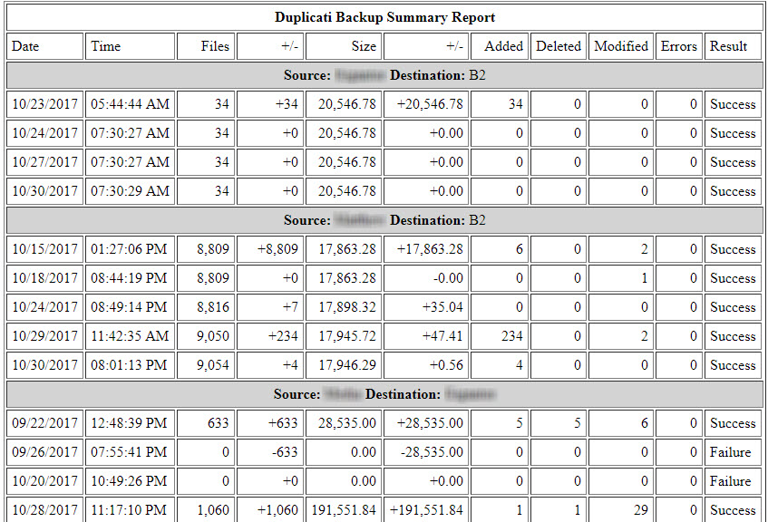
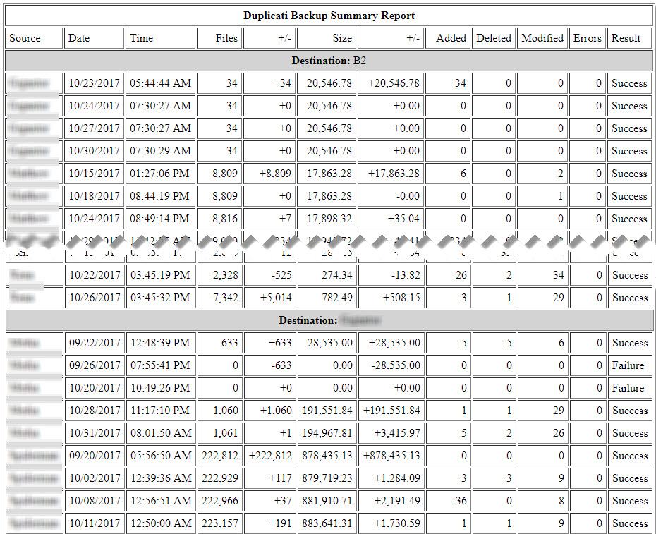
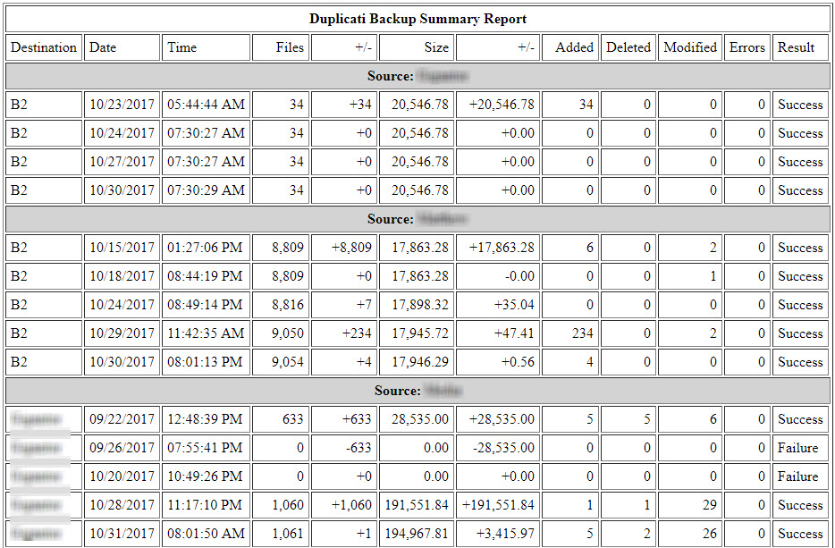
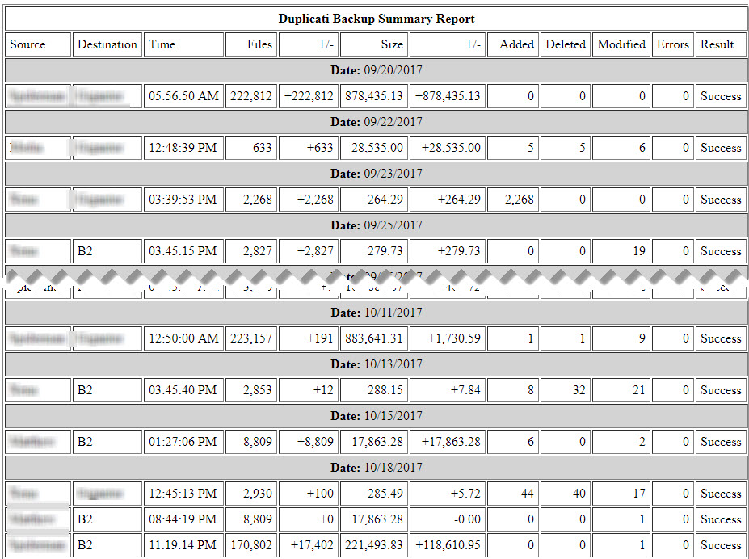

# WELCOME TO dupReport!!!

dupReport is an email-based reporting system for Duplicati. It will gather all your Duplicati backup status emails and produce a summary report on what Duplicati backup jobs were run and their success or failure.

## Available Branches

| Code            | Version      | GitHub Branch |
| --------------- | ------------ | ------------- |
| Current Release | 2.0.4        | master        |
| Current Beta    | 2.1.0 Beta 1 | 2\_1\_0_Beta  |


The GitHub "master" branch contains the latest production (stable...mostly) code. See the "changelog" file for release history, features, and bug fixes.

Other GitHub branches may contain the latest beta releases, test code, development features, and other potentially unstable code. Swim here at your own risk. Void where prohibited. Batteries not included. Freshest if eaten before date on carton. For official use only. Use only in a well-ventilated area. Keep away from fire or flames. May contain peanuts. Keep away from pets and small children. 

Bug reports and feature requests can be made on GitHub in the [Issues Section](https://github.com/HandyGuySoftware/dupReport/issuesdupReport)

The discussion group for dupReport is on the Duplicati Forum in [this thread](https://forum.duplicati.com/t/announcing-dupreport-a-duplicati-email-report-summary-generator/1116)

The program is released under an MIT license. Please see the LICENSE file for details.

Please follow dupReport on Twitter [@dupReport](https://twitter.com/DupReport)

Enjoy!

## Origin Story

The old CrashPlan Home backup system had a really nice feature whereby it would gather up the current backup status for all your systems and mail you a consolidated report on a periodic basis. It was a great way to make sure all your backups were current and to notify you if something was wrong. Duplicati has no such capability. You can configure it to send you email when backup jobs completed, but you get a separate email for each backup job that runs. In the configuration I have (9 systems backing up to 2 different storage services in various combinations) that's 14 different emails per day. Compare that with CrashPlan's one summary email per day and you can see how this was a problem. Others on the Duplicati discussion forum noticed it, too. That started me thinking about developing a tool to provide summarized email notification for Duplicati users.  

dupReport was born.  

## Source-Destination Pairs

dupReport identifies backup jobs as a series of Source/Destination pairs. dupReport uses Source-Destination Pairs to display each source job and target storage separately. The default dupReport configuration requires that jobs be named in a way that indicates what is being backed up and where it is going. For instance, a job named: “Fred_Home_Desktop-Homers_Minio would show up in the dupReport as:

\*\*\*\*\* Fred_Home_Desktop to Homers_Minio \*\*\*\*\*

Note that spaces in job names are not supported, at least by the default pattern matching.
Source/Destination pairs are specified in dupReport in the following format: 

> ```
> <Source><delimiter><Destination>
> ```

 

Where:

- \<Source\> is a series of alphanumeric characters
- \<delimiter\> is a single character (typically one of the "special" characters) and CAN NOT be a character you use in any of your Source/Destination pairs
- \<Destination\> is a series of alphanumeric characters

dupReport allows you to define the format specification of the Source, Destination, and Delimiter in the [main] section of the dupReport.rc file. Each specification is the regular expression definition of that element. The defaults are: 

```
[main]
srcregex=\w\*
destregex=\w\*
srcdestdelimiter=-
```

Together the full source/destination regex is:

```
<srcregex><srcdestdelimiter><destregex> 
```

You can modify the specification of these elements by replacing each with a regular expression defining how dupReport can find that element in a email's subject line. 

***WARNING!*** dupReport relies on the Source/Destination pair format for all of its operations. If you do not properly specify your Source/Destination pair formats in both the program (through the dupReport.rc file) and in Duplicati (through proper job naming) none of this will work for you. 

## Identifying Emails of Interest

dupReport scans the identified mailbox looking for backup job emails. However, there may be hundreds (or thousands) of emails in the inbox, only a few of which contain information about Duplicati backup jobs. dupReport identifies "Emails of Interest" by matching the email's subject line against a pattern defined in the dupReport.rc file. If the pattern matches, the email is analyzed. If the pattern does not match, the email is ignored. 

The default pattern it looks for is the phrase "Duplicati backup report for" which is the default used  for Duplicati's “send-mail-subject” advanced option. You can change the text that dupReport tries to match by adjusting the subjectregex= option in the [main] section of the dupReport.rc file. subjectregex is  the regular expression definition for the desired phrase. The default for this option is: 

```
[main]
subjectregex=^Duplicati Backup report for 
```

If you change the subjectregex option, be sure that it will match the text specified in the Duplicati send-mail-subject advanced option or you will not be able to properly match incoming emails.

Several users on the Duplicati Forum have found different ways to modify subjectregex= to get more control over finding Emails of Interest. [This idea from dcurrey](https://forum.duplicati.com/t/announcing-dupreport-a-duplicati-email-report-summary-generator/1116/15) shows one way to specify what types of report emails you are looking for.  [This post from Marc_Aronson](https://forum.duplicati.com/t/how-to-configure-automatic-email-notifications-via-gmail-for-every-backup-job/869) shows another approach. 

## System Requirements

dupReport has been formally tested on Linux (Debian 8) and Windows 10 and is officially supported on those platforms. However, users posting on the [dupReport announcement page](https://forum.duplicati.com/t/announcing-dupreport-a-duplicati-email-report-summary-generator/1116)  on the Duplicati Forum have stated they’ve installed and run the program on a wide variety of operating systems. 

In addition to the dupReport program files, the only other software dupReport needs is Python3. Installation instructions for Python are beyond our scope here, but instructions are widely available on the Internet.

## Installing dupReport

dupReport installation is easy and quick. To begin, download the dupReport files from the GitHub repository and place them in the directory of your choice. Then, make sure Python 3 is installed on your system and operating correctly.

### First-time installation

If you are running dupReport for the first time, execute the following command:

```
Linux systems: user@system:~$ dupReport.py
```

```
Windows Systems: C:\users\me> python.exe dupReport.py
```

This will perform the following actions:

1. Create and initialize the dupReport database (dupReport.db)
2. Create a default configuration file (dupReport.rc)

By default, both of these files will be created in the same directory where the dupReport.py script is located. If you want them created in another location use the following program options:

```
dupReport.py -r <RC_Directory> -d <Database_Directory>
```


Both \<RC_Directory\> and \<Database_Directory\> must be directory specifications, *<u>not</u>* full file paths. dupReport will create the .rc and database files in their respective paths. Both directories must already exist and you must have access permissions to those locations.

Once the files are created the program will exit. You will then need to edit the dupReport.rc file with the appropriate entries to point to your database and log files as well as providing the locations and credentials for your email servers. More information on the .rc file configuration can be found below under “RC File Configuration.”

### Upgrading from a Previous Version

If you have been running an earlier version of dupReport, the program will automatically update the dupReport.rc file and the dupReport.db database to the latest versions. Depending on the extent of the changes, the program may indicate that you need to edit the dupReport.rc file to set any new options correctly. 

As a precaution, **it is highly recommended that you backup your .rc and .db files to a safe place** before proceeding with the upgrade until you're sure everything is working properly.

## Command Line Options

Command line options alter the way dupReport operates. Many command line options have equivalent options in the dupReport.rc file. If an option is specified on both the command line and in the .rc file, the command line option takes precedence.

dupReport has the following command line options:

| Short Version               | Long Version                    | Description                              |
| --------------------------- | ------------------------------- | ---------------------------------------- |
| -h                          | --help                          | Display command line options.            |
| -r \<rcpath\>               | --rcpath \<rcpath\>             | Sets \<rcpath\> as the directory where the dupReport.rc file is located. \<rcpath\> should point to the directory only, not a full file path specification. |
| -d \<dbpath\>               | --dbpath \<dbpath\>             | Sets \<dbpath\> as the directory where the dupReport.rc file is located. Overrides the [main] dbpath= option in dupReport.rc file. \<dbpath\> should point to the directory only, not a full file path specification. |
| -l \<logpath\>              | --logpath \<logpath\>           | Sets \<logpath\> as the directory where the dupReport.log file is located. Overrides the [main] logpath= option in dupReport.rc file. \<logpath\> should point to the directory only, not a full file path specification. |
| -v {0,1,2, 3}               | --verbose {0,1,2, 3}            | Sets the verbosity of the information in the log file. 1=General program execution info. 2=Program flow and status information. 3=Full debugging output |
| -a                          | --append                        | Append new logs to existing log file. Overrides [main] logappend= in dupReport.rc file. |
| -s {‘byte’, ‘mega’, ‘giga’} | --size {‘byte’, ‘mega’, ‘giga’} | Display file sizes in bytes, megabytes, or gigabytes |
| -i                          | --initdb                        | Erase all information from the database and resets the tables. |
| -c                          | --collect                       | Collect new emails only and don't run summary report. -c and -t options can not be used together. |
| -t                          | --report                        | Run summary report only and don't collect emails. -c and -t options can not be used together. |
| -b \<DateTimeSpec\>         | --rollback \<DateTimeSpec\>     | Roll back database to a specified date and time. \<DateTimeSpec\> must be in one of the following formats: “MM/DD/YY” or “MM/DD/YY HH:MM:SS” The date and time portions of the \<DateTimeSpec\> must be in the format specified by the “dateformat=” and “timeformat=” options specified in the [main] section of the dupReport.rc file. See the discussion of the dateformat= and timeformat= options below. |
| -f \<filespec\>,\<type\>    | --file \<filespec\>,\<type\>    | Send the report to a file in text, HTML, or CSV format. -f may be used multiple times to send the output to multiple files. \<filespec\> can be one of the following: A full path specification for a file; 'stdout', to send to the standard output device; 'stderr', to send to the standard error device. \<type\> can be one of the following: “Txt”, “Html”, or “csv” |
| -x                          | --nomail                        | Do not send the report through email. This is typically used in conjunction with the -f option to save the report to a file rather than send it through email. |
| -m <source> <destination>   | --remove <source> <destination> | Remove a source/destination pair from the database. |


## dupReport.rc Configuration

The dupReport.rc file contains configuration information for dupReport to run properly. Many options in the dupReport.rc file have equivalent command line options. If an option is specified on both the command line and the .rc file, the command line option takes precedence.

### [main] section

The [main] section contains the high-level program options for dupReport to run properly.

```
version=<major>.<minor>.<subminor>
```

The current version number of the program. Used to determine if the .rc file needs to be updated. **PLEASE DO NOT** alter the version= option

```
dbpath=<dbpath>
```

 Directory where the dupReport.db file is located. Can be overridden by the -d command line option.

```
logpath=<logpath> 
```

The directory where the dupReport.log file is located. Can be overridden by the -l command line option.

```
verbose=
```

- 0=No log output
- 1=(Default) General program execution info.
- 2=Program flow and status information
- 3=Full debugging output

Sets the level of detail the program will put in the log file. Can be overridden by the -v command line option.

```
logappend=false
```

Append new logs to the log file (true) or reset log file for each run (false). Can be overridden by the -a command line option.

```
subjectregex=^Duplicati Backup report for
```

A regular expression used to find backup message Emails Of Interest. This should somewhat match the text specified in the ‘send-mail-subject’ advanced option in Duplicati.

```
srcregex=\w*
```

Regular expression used to find the “source” side of the source-destination pair in the subject line of the email.

```
destregex=\w*
```

Regular expression used to find the “destination” side of the source-destination pair in the subject line of the email.

```
srcdestdelimiter=-
```

Single character used to specify the delimiter between the ‘source’ and ‘destination’ parts of the source-destination pair.

```
dateformat=MM/DD/YYYY
```

Default format for dates found in emails. Acceptable formats are:

- MM/DD/YYYY
- DD/MM/YYYY
- MM-DD-YYYY
- DD-MM-YYYY
- MM.DD.YYYY
- DD.MM.YYYY
- YYYY/MM/DD
- YYYY/DD/MM
- YYYY-MM-DD
- YYYY-DD-MM
- YYYY.MM.DD
- YYYY.DD.MM

If there are problems in your report dates (especially of your locale doesn't use U.S.-style dates), or if you are getting program crashes around the date/time routines, you might try checking and/or changing this value.

The default format can be overridden for specific backup jobs by specifying a dateformat= line in a job-specific section of the .rc file. See “[source-destination] Sections” below.

```
timeformat=HH:MM:SS
```

Default format for times found in emails. The only time format currently acceptable is ‘HH:MM:SS’. The default format can be overridden for specific backup jobs by specifying a timeformat= line in a job-specific section of the .rc file. See “[source-destination] Sections” below.

```
warnoncollect=false
```

If true, send an email if there are warning or error messages in incoming email. Only works if the -c option is specified so the user will get error messages even if they are not producing an email report.

```
applyutcoffset=true
```

Duplicati version 2 does not apply local time zone information when reporting start and end times for backup jobs. If set to 'true', this option takes the UTC time zone offset from the email header and applies it to the backup job start and end times. If the backup times in your report do not look right, try adjusting this value.

```
show24hourtime=false
```

 If true, times will be displayed in 24-hour notation. Otherwise, dupReport will use 12-hour, AM/PM notation.

### [incoming] section

The [incoming] section contains settings for incoming email that dupReport reads to create the report. 

```
transport=imap
```

 Specify the transport mechanism used to gather emails from the email server. Can be 'imap' or 'pop3'

```
inserver=localhost
```

DNS name or IP address of email server where Duplicati result emails are stored. 

```
inport=995
```

IMAP or POP3 port for incoming email server. 

```
inencryption=tls
```

Specify encryption used by incoming email server. Can be 'none', 'tls' (default), or 'ssl'

```
inaccount=<account_name>
```

User ID on incoming email system

```
inpassword=<password>
```

Password for incoming email system

```
infolder=INBOX
```

Email account folder where incoming Duplicati email is stored. This parameter is used for IMAP systems and ignored for POP3 systems.

### [outgoing] section

The [outgoing] section contains settings for the email server that dupReport will use to send the final summary report email. 

```
outtransport=smtp
```

Specify the transport protocol used to send emails to the outgoing server. Only SMTP is supported for outgoing email.

```
outserver=localhost
```

DNS name or IP address of outgoing email server. 

```
outport=587
```

SMTP port for outgoing email server. 

```
outencryption=tls
```

Specify the encryption used by outgoing email server. Can be 'tls' or 'none'

```
outaccount=<account name>
```

User ID on outgoing email system.

```
outpassword=<password>
```

Password for outgoing email system.

```
outsender=sender@somemail.com
```

Email address of report sender.

```
outreceiver=receiver@somemail.com
```

Email address of report recipient. 

### [report] section

The [report] section contains settings for the final report created by dupReport.

```
style=srcdest
```

Specifies the type of report for dupReport to create. Allowable report styles are:

- **srcdest**: Backup jobs grouped by source/destination pairs
- **bydest**: Backup jobs grouped by destination systems
- **bysource**: Backup jobs grouped by source systems
- **bydate**: backup jobs grouped by run date

See “Report Formats” below for more information on reporting formats and options.

```
sortby=source
```

Specify how to sort the data within the report specified by the style= parameter

Allowable sorting options are:

- **srcdest**: 'source' or 'destination'
- **bydest**: 'source' or 'date'
- **bysource**: 'destination' or 'date'
- **bydate**: 'source', 'destination', or 'time'

```
reporttitle=Duplicati Backup Summary Report
```

Main report tile used for the report.

```
subheading=Report Subheading
```

Text to use as the subheading of the report. Because the subheading is different for each report there is no default for this option and you will need to manually add it to the .rc file to enable it.

**Keyword Substitution**: You can supply keywords within the subheading option to customize the way it looks. Available keywords are:

- \#SOURCE#: Inserts the appropriate source name in the subheading
- \#DESTINATION#: Inserts the appropriate destination name in the subheading
- \#DATE#: Inserts the appropriate date in the subheading

For example, in the srcdest report an appropriate subheading might be:

```
subheading = Source System: #SOURCE# Destination System: #DESTINATION#
```

For the bydest report an appropriate subheading might be:

```
subheading = Target Destination: #DESTINATION#
```

Not all keywords are appropriate for all reports, so you may have to try different options to find the one(s) that fit. If you're so inclined, the source code files for the reports (rpt_\*.py) will give an indication of which keywords will work with each report.

```
border=1
```

Size in pixels of the borders in the report table. (HTML only)

```
padding=5
```

Size of cell padding in the report table. (HTML only)

```
displaymessages=false
```

Display any informational messages contained in the Duplicati email. Default is false

```
displaywarnings=true
```

Display any warning messages contained in the Duplicati email. Default is true

```
displayerrors=true
```

Display any error messages in the Duplicati email. Default is 'true'

```
sizedisplay=byte
```

Display file sizes in bytes, megabytes, or gigabytes. Can be overridden by the -s option on the command  line. Default is 'byte'

```
showsizedisplay=true
```

Determine whether to show the size indicator ('MB' or 'GB') in the size columns.

```
repeatheaders=true
```

Indicates whether to repeat the column headers for each report section (true) or only at the beginning of the report (false). Default is 'false'

```
titlebg=#FFFFFF
```

Background color for report title. (HTML only)

```
subheadbg=#D3D3D3
```

Background color for report subheadings. (HTML only)

```
jobmessagebg=#FFFFFF
```

Background color for job messages. (HTML only)

```
jobwarningbgDefault=#FFFF00
```

background color for job warning messages. (HTML only)

```
joberrorbg=#FF0000
```

HTML background color for job error messages. (HTML only)

### [headings] section

The [headings] section contains the default column titles for the fields used in all the dupReport reports. You can alter the headings to suit your tastes. For example, to change the heading for the “size” column from “Size” to “How Big?”, change:

```
size = Size
```


To

```
size = How Big?
```


Once this change is made, any report that displays the “size” column will display the text “How Big?” as the column header.

To prevent a field from displaying on a report, leave the heading specification blank for that field. For example, to prevent the “added” field from displaying on a report, change its line in the [headings] section to:

```
added =
```

| Heading Field    | Notes                                    |
| ---------------- | ---------------------------------------- |
| source           | The source system for the backup         |
| destination      | The destination system for the backup    |
| date             | The date of the backup                   |
| time             | The time of the backup                   |
| files            | Number of files examined by the backup job |
| filesplusminus   | The increase (+) or decrease (-) in the number of files examined since the previous backup |
| jobsize          | The total size of the files examined by the backup |
| jobsizeplusminus | The increase (+) or decrease (-) in the total size of files examined since the previous backup job |
| added            | Number of blocks added to the backup     |
| deleted          | Number of blocks deleted from the backup |
| modified         | Number of blocks modified by the backup  |
| errors           | Number of errors encountered during the backup |
| result           | The final result of the backup job (e.g., Success, Failure, etc) |
| jobmessages      | Messages generated by the backup job during its run. This column can also be suppressed by setting displaymessages=false in the [report] section. |
| jobwarnings      | Warning messages generated by the backup job during its run. This column can also be suppressed by setting displaywarnings=false in the [report] section |
| joberrors        | Error messages generated by the backup job during its run. This column can also be suppressed by setting displayerrors=false in the [report] section |

### [source-destination] sections

Specific options can also be set for each source/destination pair in the system. For example, to specify parameters specifically for a backup job named “Client-Server”, there should be a section in the .rc file with the following name:

```
[Client-Server]
```


Note that the section name must match the Source/Destination pair name ***exactly***, including capitalization and delimiter characters. If there is any difference between the source/destination name and the .rc file section name, the program will not be able to match the proper parameters to the correct backup job.
The only options currently recognized in the [source-destination] section are the following:

```
[Client-Server]
dateformat=
timeformat=
```

The allowable values for these options are the same as the dateformat= and timeformat= options in the [main] section. Specifying date and time formats on a per-job basis allows the program to properly parse and sort date and time results from backups that may be running in different locales and using different date/time display formats. If a job-specific report section is not present in the .rc file, the default [main] options will be used.

The job-specific report section is only applied to the parsing of incoming emails. Dates and times produced in the final report are always formatted according to the default dateformat= and timeformat= options in the [main] section.

## Report Formats

dupReport has several formats for reporting that are specified in the “style” parameter in the [report] section of the dupReport.rc file. Each report can be sorted in various ways. Sorting options are configured using the “sortby” option in the [report] section.

------

The ‘srcdest’ report, also known as the “classic” report, displays backup jobs in groups of source/destination pairs. Here is an example of the ‘srcdest’ report:




------

The 'bydest' report displays backup jobs grouped by destination. Here is an example of the ‘bydest’ report:




------

The ‘bysource’ report displays backup jobs grouped by source. Here is an example of the ‘bysource’ report:




------

The ‘bydate’ report displays backup jobs grouped by the date the jobs were run. Here is an example of the ‘bydate’ report:



